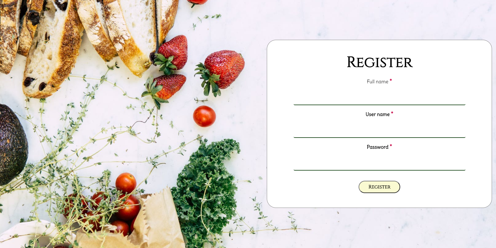

# Cachow
Link to the Live App:  https://cachow.vercel.app/ 

## API
In use with the Cachow API located at https://github.com/LSunny5/CaChow-API

### Description
This project was bootstrapped with [Create React App](https://github.com/facebook/create-react-app).

Cachow is a site where you can see and enter menus for different restaurants and easily access it from one site. The inspiration is from family and friends who are always browsing through several sites to find the menus for different food places. With Cachow, you can have all your menus in one place and search through multiple menus. The address and phone numbers can be added as well.  If the restaurant is not there, you can add it and it will be in your list.  There is a demo account to try it out.  Visit the site to check it out.  You can register and sign up for your own account after.   

### Technologies Used
React, Javascript, HTML5/CSS3

### Screenshots

### Hosted on 
Vercel 

#### Available Scripts
In the project directory, you can run:

##### `npm start`
Runs the app in the development mode. 
Open [http://localhost:3000](http://localhost:3000) to view it in the browser.

The page will reload if you make edits. 

##### `npm test`
Launches the test runner in the interactive watch mode. 
See the section about [running tests](https://facebook.github.io/create-react-app/docs/running-tests) for more information.

##### `npm run build`
Builds the app for production to the `build` folder. 
It correctly bundles React in production mode and optimizes the build for the best performance.

The build is minified and the filenames include the hashes. 
Your app is ready to be deployed!

See the section about [deployment](https://facebook.github.io/create-react-app/docs/deployment) for more information.

#### Learn More
You can learn more in the [Create React App documentation](https://facebook.github.io/create-react-app/docs/getting-started).

To learn React, check out the [React documentation](https://reactjs.org/).

#### Production Mode
http://localhost:3000/ 